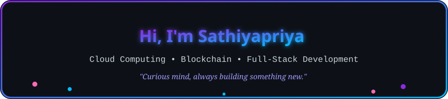
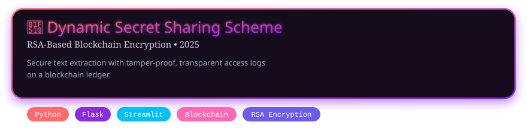
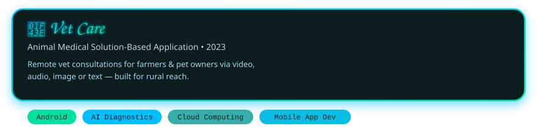
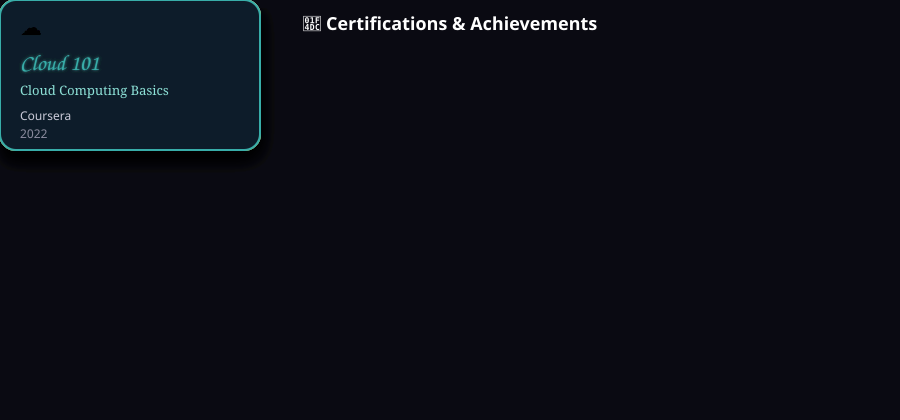

  

  

  

---

<table>
<tr>
<td width="55%" valign="top">

- 🎓 M.Sc. Computer Science graduate (Karpagam Academy of Higher Education, 2025 — 8.7 CGPA)
- 🔭 Interested in **Cloud Computing, Blockchain Technology, Cryptography & Network Security**
- 🌱 Currently exploring **RAG, LangChain, and AI Agents**
- 📝 Published research: *Dynamic Secret Sharing Scheme Using RSA-based Blockchain Encryption* (2025)
- 💬 Ask me about **Blockchain Encryption, Cloud Computing, or Web Development**

</td>
<td width="45%">

</td>
</tr>
</table>

---

### 🛠️ Tech Stack

  

---

### 📊 GitHub Stats

  
  

  

---

### 🏆 GitHub Trophies

  

---

### 📌 Featured Projects

  

  

> Replace the placeholder card links once you push the project repos — add a `[View Repo]` link under each banner: `[View Repo](https://github.com/sathyaverse/repo-name)`

---

### 📈 Contribution Graph

  

---

### 🐍 Contribution Snake

  

---

### 📜 Certifications & Achievements

  

---

### 🌐 Connect with Me

  
  
  
  

  

